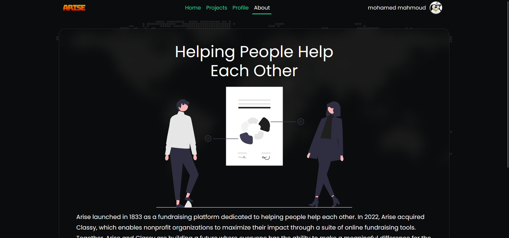
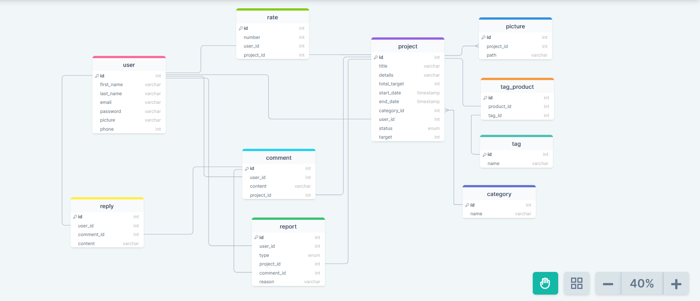
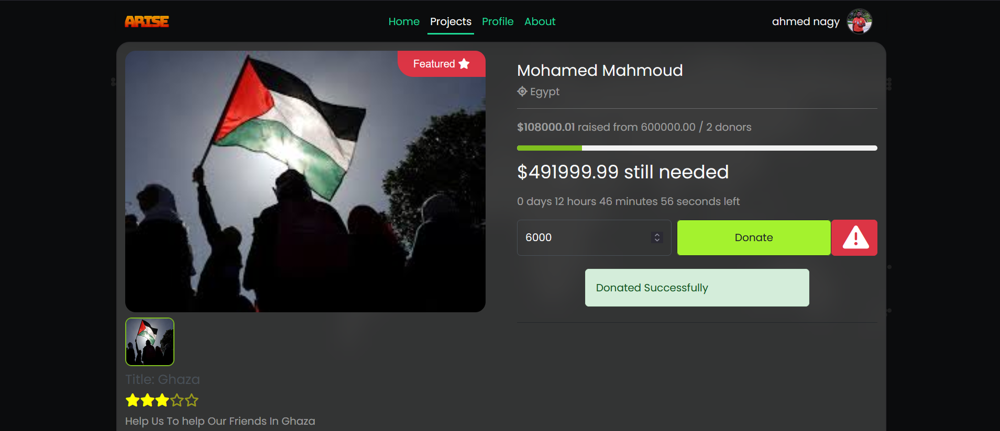

# Crowd-Funding Web Application

Crowdfunding is the practice of funding a project or venture by raising small amounts of money from a large number of people, typically via the Internet. The aim of this project is to create a web platform for starting fundraising projects in Egypt.

## Table of Contents

- [Features](#features)
- [Technologies Used](#technologies-used)
- [Project Structure](#project-structure)
- [Screenshots](#screenshots)
- [Installation](#installation)
- [Usage](#usage)
- [Contributing](#contributing)
- [License](#license)

## Features

1. **Authentication System:**
   - Registration with email verification.
   - Login with email and password.
   - Login with Facebook account (Bonus).
   - Forgot Password (Bonus).
   - User Profile:
     - View profile information.
     - View owned projects.
     - View donations.
     - Edit profile information (except email).
     - Delete account with confirmation (Bonus: password required).
2. **Projects:**
   - Create fundraising campaigns with:
     - Title
     - Details
     - Category
     - Multiple pictures
     - Total target
     - Multiple tags
     - Start/end time for the campaign
   - View projects and donate.
   - Add comments on projects (Bonus: with replies).
   - Report inappropriate projects or comments.
   - Rate projects.
   - Project creators can cancel projects if donations are less than 25% of the target.
   - Project page displays overall average rating, project pictures in a slider, and 4 similar projects based on tags.
3. **Homepage:**
   - Slider to show the highest five rated running projects.
   - List of the latest 5 projects.
   - List of latest 5 featured projects.
   - List of categories with their projects.
   - Search bar to search projects by title or tag.

## Technologies Used

- Vue.js
- Django
- MySQL

## Project Structure
```
project/
├── frontend/ # Vue.js frontend
├── src/
├── public/
├── ...
├── backend/ # Django backend
├── app/
├── manage.py
├── ...
├── database/ # MySQL database schema
├── schema.sql
├── ...
├── related_images/ # Screenshots related to the project
├── AboutUs.png
├── Schema.png
├── admin-add-feature-project.png
├── ...
└── README.md

```

## Screenshots


- 

 *About Us*


- 

 *Database Design Schema*


- 

 *Homepage*


- 

 *User Donates to a Project*


- 

 *User Reports a Comment*


- 

 *Admin Reports Page*


- 

 *Admin can add projects with features section*


- 

 *Admin can show all the projects with the canceled one*


- 

 *Admin can delete a project*


- 

 *Admin can show all the reports on comments and reports*


- 

 *Admin can show all the categories and tags*

## Installation

1. Clone the repository:

```bash
git clone https://github.com/your_username/your_project.git
```
2. Install dependencies:
```bash
# Frontend
cd frontend
npm install

# Backend
cd backend
python -m venv venv
venv\Scripts\activate
pip install -r requirements.txt
```
3. Database setup:
- Create a MySQL database.
- Import schema.sql to set up the database schema.

4. Configuration:
- Configure backend settings in backend/project/settings.py.
- Configure database settings in backend/project/settings.py

## Usage
1. Run the backend server:
```bash
cd backend
python manage.py runserver
```
2. Run the frontend:
```bash
cd frontend
npm run serve
```
3. Open your browser and go to http://localhost:8080 to access the application.
